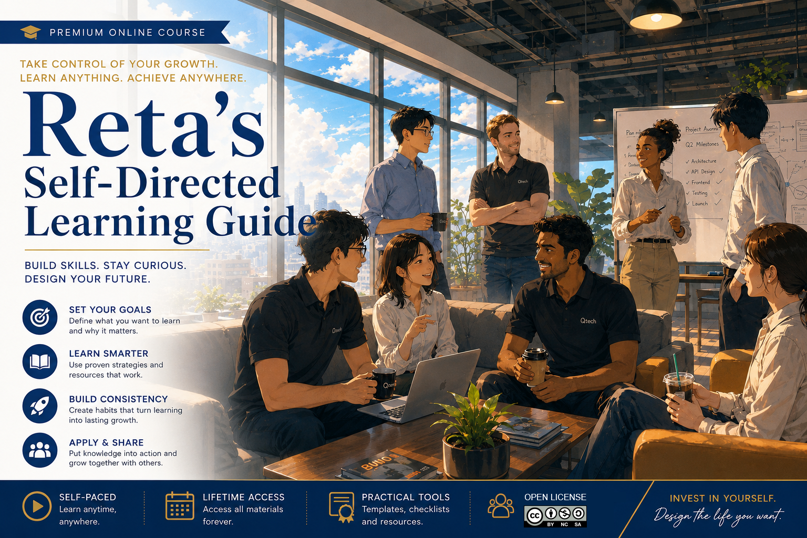

# Reta's Self-Directed Learning Guide｜Reta 的自主學習指南

## Agile and Software Engineering｜敏捷與軟體工程

分享軟體工程相關知識，涵蓋流程設計、管理技術、CI/CD、敏捷方法與各種框架，帶你全面掌握開發與管理的核心要點。  
Sharing knowledge in software engineering—covering process design, management techniques, CI/CD, agile practices, and various frameworks—to help you master the core essentials of development and management.  

| Video | Description | Date |
|:----|:----------|:--|
| [Lesson 01: Agile and Software Engineering Overview 敏捷與軟體工程全覽](AgileSoftwareEngineering/2025-11-09_AgileProjectMgt/README.md) | Processes, History, Scope, Comparisons, and Its Impact on Project Management and PDCA 敏捷與軟體工程全覽｜敏捷的流程、歷史、應用範圍與比較，以及它如何影響專案管理與PDCA。 | 2025-11-09 |    
| [Lesson 02: Business Requirement Definition 商業需求定義](AgileSoftwareEngineering/2025-12-08_BusinessReqDef/README.md) | From Concepts to Practice: A Complete Guide! 從觀念到實務．完全攻略！| 2025-12-08 |  
| [Agile Team：Identification and Management 敏捷團隊：識別與管理](AgileSoftwareEngineering/2026-02-22_AgileTeam/README.md) | Four Team Types Mapped to Four ARCI Management Models, Applicable to Five Task Assignment Scenarios: Build and Manage Agile Teams Effectively! ４大團隊類型，對應４種 ARCI 管理模型，適用５大情境任務指派。正確地打造與管理敏捷團隊！| 2026-02-22 |  

---

## Management｜管理

分享軟體管理、風險控管、資安治理與專案管理的知識與實務心得，帶你深入探索管理與治理的核心要點。  
Insights into software management, risk control, cybersecurity governance, and project management—helping you grasp the key principles of management and governance.  

| Video | Description | Date |
|:----|:----------|:--|
|[Measuring AI’s Impact on Teams  AI 效益評鑑指標](Management/2026-05-18_AIReflectMeasurement/README.md) | Measuring and Governing Artificial Intelligence (AI) Impact on Team Performance  衡量與治理人工智慧（AI）對團隊績效的影響 | 2026-05-18 |
|[Agile Team：Identification and Management 敏捷團隊：識別與管理](AgileSoftwareEngineering/2026-02-22_AgileTeam/README.md) | ４大團隊類型，對應４種 ARCI 管理模型，適用５大情境任務指派。正確地打造與管理敏捷團隊！| 2026-02-22 |  
|[AI 風險管理（法律篇） AI Risk Management (Legal Perspective) ](Management/2024-11-11_AI-Risk-Management/README.md)|`Traditional Chinese`  企業導入 AI 前一定要知道的法律重點｜一般使用者也千萬別踩雷！  Essential Legal Considerations Before Enterprise AI Adoption｜Key Pitfalls General Users Must Avoid!| 2024-11-11 |

---

## Software Development｜軟體開發  

探索軟體開發的技巧、觀念與知識分享，帶你掌握實務精華，拓展開發思維。  
Exploring software development through practical tips, key concepts, and knowledge sharing—helping you master essential skills and broaden your development mindset.  

| Video | Description | Date |
|:----|:----------|:--|
| [Extremely Clean Code 極致精煉程式碼的範例](AgileSoftwareEngineering/2025-05-07_ExtremelyCleanCode/README.md) | Code Beyond AI’s Reach AI 無法超越的程式碼 |2025-05-07|  

---

## Personal Reflections｜人生心得

分享生活哲學與人生心得，探索超越宗教束縛的觀點與思路，帶你開拓更自由的思維視野。  
Sharing life philosophy and personal reflections, exploring perspectives and ideas that transcend religious constraints—inviting you to broaden your mind with greater freedom.  

| Video | Description | Date |
|:----|:----------|:--|
| [佛陀的策略課：四聖諦 The Buddha’s Strategy Lesson: The Four Noble Truths ](https://youtu.be/Z-Ml2jpvTCQ) | `Traditional Chinese`  最直白精闢的究竟解脫之路｜安定自心的強大力量｜人生苦海的真正原因 The Most Direct Path to Ultimate Liberation｜The Powerful Force of Inner Stability｜The True Cause of Life’s Suffering | 2024-12-17 |  
| [聖嚴法師的眾願成就理念之一： 四它 One of Master Sheng Yen’s Concepts of Fulfilling Collective Aspirations: The Four “Its”](https://youtu.be/1yBwxDKRZQc) | `Traditional Chinese`  最直白精闢的解釋與例證｜人生苦海的真正原因。 The Most Clear and Insightful Explanations with Examples｜The True Cause of Life’s Suffering | 2024-12-27 |  

---
  
## Technology｜科學與科技

探索科學與科技的知識分享、深入分析與觀察，帶你掌握前沿洞見，拓展思維視野。  
Exploring science and technology through knowledge sharing, in-depth analysis, and thoughtful observations—guiding you to grasp cutting-edge insights and broaden your perspective.  

### AI
| Video | Description | Date |
|:----|:----------|:--|
|[AI 趨勢觀察 AI Trends Observation](Technology/AI/2026-03-27_Live-with-AI/README.md)|`Traditional Chinese`  市場機制、產業變革、人類世界的全面反思 Market Mechanisms, Industrial Transformation, and a Comprehensive Reflection on Human Society | 2026-03-27 |
|[我的天！AI又歪了！ Oh My! AI Has Gone Off Track Again!](Technology/AI/2025-12-13_AI-Ruined/README.md)|`Traditional Chinese`  人類遇到 AI，歪樓、講笑話、練肖維、腦筋急轉彎！每個都按讚！ AI就廢了．．． When Humans Meet AI: Going Off-Topic, Telling Jokes, Acting Silly, and Playing Brain Teasers! Like Every One of Them—and AI Becomes Useless... 本影片由真人真事改編。 This video is based on real events.| 2025-12-13 |
|[AI 風險管理（法律篇） AI Risk Management (Legal Perspective) ](Management/2024-11-11_AI-Risk-Management/README.md)|`Traditional Chinese`  企業導入 AI 前一定要知道的法律重點｜一般使用者也千萬別踩雷！  Essential Legal Considerations Before Enterprise AI Adoption｜Key Pitfalls General Users Must Avoid!| 2024-11-11 |
|[The Limits of AI Intelligence AI 的智力極限](Technology/AI/2024-11-05_The-Intellectual-Limits-of-AI/README.md)|“Taming the Mind” in 5 Minutes｜Why AI Cannot Replace Humans 5分鐘「降伏其心」｜為何 AI 無法取代人類| 2024-11-05 |
|[Five Revolutionary Pillars Supporting AI 撐起AI的5個革命性「台柱」](Technology/AI/2024-10-28_AI-RevolutionaryTechnologes/README.md)|Chip Breakthroughs Beyond Moore’s Law｜Nuclear Waste Batteries That Can Generate Power for 28,000 Years! 晶片突破摩爾定律｜核廢料電池可發電2.8萬年！| 2024-10-28 |

---

## License｜授權條款

  
This work © 2026 by Jen Yuan Pan is licensed under [Attribution-NonCommercial-ShareAlike 4.0 International](https://creativecommons.org/licenses/by-nc-sa/4.0/legalcode.en).  
本作品 © 2026 作者 潘貞元（Reta Pan），採用  [姓名標示－非商業性－相同方式分享 4.0 國際](https://creativecommons.org/licenses/by-nc-sa/4.0/legalcode.en) 授權。  
